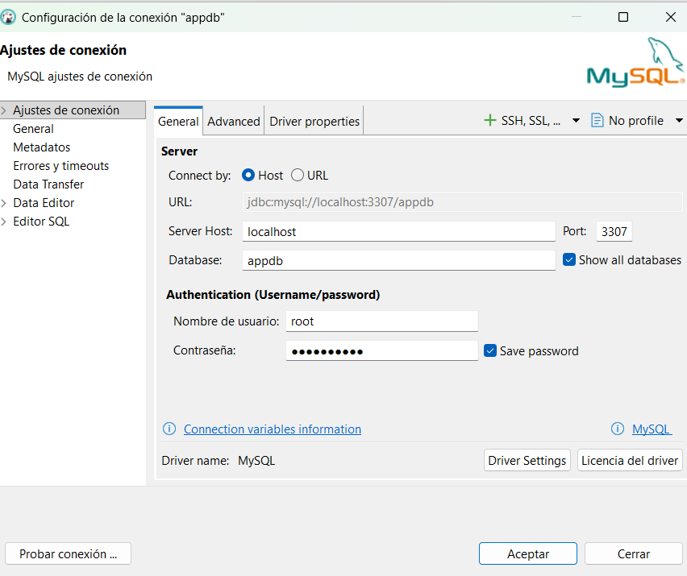
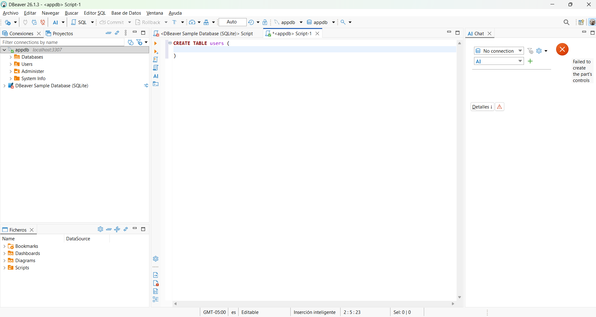
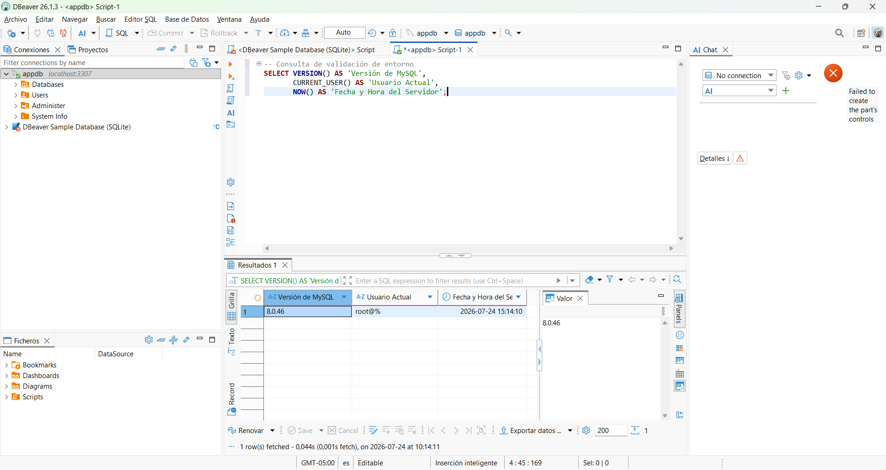

# Instalación y Configuración de MySQL

## Nombre: Juan Acevedo
## Sistema: Windows

# Proceso de Instalación y Configuración de MySQL en DBeaver

## 1. Descarga e Inicio
* **Descarga de DBeaver:** Descarga e instala la aplicación desde su sitio web oficial. 
* **Selección del Motor MySQL:** Abre DBeaver, haz clic en el ícono de "Nueva Conexión" (con forma de enchufe) y selecciona **MySQL** en la lista de bases de datos disponibles. Si es la primera vez que te conectas a MySQL, DBeaver te pedirá descargar los controladores (drivers) oficiales de forma automática; simplemente acepta la descarga.

## 2. Configuración de Usuario/Contraseña
* **Ajustes del Servidor:** En la ventana de configuración, verifica la dirección del servidor (Generalmente `localhost` en el puerto `3306` si está en tu propio equipo).
* **Ingreso de Credenciales:** En la sección de Autenticación, introduce tu **Username** (por defecto suele ser `root`) y tu **Password** (la contraseña de administrador que asignaste a tu servidor MySQL cuando lo instalaste).

## 3. Finalización
* **Prueba de Conexión:** Haz clic en el botón **"Test Connection"** (Probar conexión) para asegurarte de que DBeaver se puede comunicar correctamente con el servidor MySQL.
* **Guardar:** Si la prueba arroja un mensaje de éxito, haz clic en el botón **"Finish"** (Finalizar). 
* **Listo para operar:** Tu conexión de MySQL ahora aparecerá en el panel lateral (Database Navigator), lista para navegar por las tablas, ejecutar scripts y gestionar tus bases de datos.

## Galeria de evidencias

